<div align="center">
<h1>oclif-keycloak-oauth2-flows-sample</h1>

Real-world example of how to implement OAuth 2.0 protocol authentication flows in a Command Line Interface (CLI) using oclif.io and Keycloak! 🚀

[](https://oclif.io)


</div>

# Summary

- [Motivation ✨](#motivation-)
- [Before exploring](#before-exploring)
  - [Pre-requisites](#pre-requisites)
  - [Up and Running!](#up-and-running)
- [The Command Line OAuth 2.0 Tricks](#the-command-line-oauth-20-tricks)
- [Diagrams](#diagrams)
  - [Device Code Flow](#device-code-flow)
  - [Authorization Code Flow](#authorization-code-flow)
- [Commands](#commands)
  - [`./bin/run auth login`](#binrun-auth-login)
  - [`./bin/run auth logout`](#binrun-auth-logout)
  - [`./bin/run auth status`](#binrun-auth-status)
  - [`./bin/run help [COMMAND]`](#binrun-help-command)

# Motivation ✨

CLI authentication can even be trivial when you use `-u` for username and `-p` for password to perform authentication. This real-world example originated from the idea of figuring out how CLIs like GitHub and Heroku perform login using more elegant flows than just inputting username and password. Using Keycloak in the use case was just to avoid having to create an OAuth Server from scratch 😅.

The purpose and resolution of this project was to answer questions such as:

- How to login a user in a CLI without explicitly using credentials (with the `-u` and `-p` flags, for example);
- Is it possible to use the OAuth 2.0 protocol in a command line interface?
- How and where to store user credentials while maintaining an active session from a command-line interface?

The answer to these (and maybe even other questions) you can find in the source code and `README.md` of this project.

# Before exploring

As I mentioned above, using Keycloak was just for him to take care of our OAuth Server part. As it is a dependency for the project to work well, you need to provision a Keycloak instance in your environment. Let's do this using Docker with `docker-compose`.

## Pre-requisites

In this walkthrough it's assumed that you have the tools installed:

- [Docker](https://www.docker.com/get-started): 20.10.11 or higher.
- [docker-compose](https://docs.docker.com/compose/install/): 1.29.2 or higher.
- [NodeJS](https://nodejs.org/en/download/): 16.17.1 or higher.

## Up and Running!

There is already a `docker-compose.yaml` configured in this project. In the terminal, in the root of the project, execute the command to start the Keycloak:

```sh
docker-compose up -d
```

Let's check the logs if Keycloak has started:

```sh
docker-compose logs -f keycloak | grep -i "Admin console listening on"
```

> 💡 Wait until a message appears on terminal output. After viewing the log, Keycloak will be available at: http://127.0.0.1:8080

Thanks to the [.docker/keycloak-realm.json](./.docker/keycloak-realm.json) file we won't need to waste so much time in this configuration. The only thing you will need to do is register a new account when running the [CLI authentication command](#binrun-auth-login) (clicking the register button and setting the basic information and credentials).

# The Command Line OAuth 2.0 Tricks

There are some tricks to perform transparent user authentication (avoiding the need for credentials to be copied back and forth).

- **[Device Code flow](#device-code-flow)**: the CLI asks for an authorization code and gets a verification URL that opens in a browser. Then, with the authorization code (and the interval obtained in the authorization code request) **it performs a pooling** for the `POST token` endpoint of the OAuth Server. Only when the user informs the code that the CLI displayed in the terminal (in the page that was opened in the browser) that the `POST token` endpoint will return the `access_token` and `refresh_token`.
- **[Authorization Code Flow](#authorization-code-flow)**: in this flow one of the coolest things happens! The CLI assembles the authorization URL and before opening the URL in the browser, a local HTTP server is started (with the port and address already configured as valid redirect URLs in the OAuth server client) which will receive the connection back from the OAuth server with the parameters used to obtain the `access token` and `refresh token` (`state` to validate the PKCE challenge, and `code` to exchange tokens). The server stands and "hangs" the execution of the CLI (we wait until the user is authenticated). Once logged in, the OAuth Server redirects to the CLI URL and we can exchange tokens to log in the user.

  > The authorization URL looks something like this: http://127.0.0.1:8080/auth/realms/oclif-keycloak/protocol/openid-connect/auth?response_type=code&client_id=oclif-keycloak&redirect_uri=http%3A%2F%2F127.0.0.1%3A5657%2Fauth%2Fcallback&state=7032631ed63fcd2aec4fb681d45b9c7c897d9f37febc04632205987b1da310cf&code_challenge=jCVXY-tWp4J0qwPXcI_XdbFOmHQIjufF79fkhyYIqMk&code_challenge_method=S256

# Diagrams

## Device Code Flow

```mermaid
sequenceDiagram
    autonumber
    title: Device Code Flow

    actor User
    participant CLI
    participant OAuth Server

    User->>CLI: ./bin/dev auth login -f device-code
    CLI->>OAuth Server: Request device code
    note right of CLI: POST /auth/token
    OAuth Server->>CLI: Returns device_code, user_code, <br> verification_uri, and interval
    CLI->>User:  Open browser with verification_uri <br> (Waiting for authentication...)
    CLI->>+OAuth Server: Poll for access_token and refresh_token
    note right of CLI: POST token
    par browser
        User->>OAuth Server: Enter user_code
        note right of OAuth Server: Mark device as authorized
    end
    OAuth Server->>-CLI: Returns access_token and refresh_token
    CLI->>CLI: Save user credentials in $HOME/.clirc file
    CLI->>User: Waiting for authentication... done ✅
```



## Authorization Code Flow


# Commands

<!-- commands -->

- [`./bin/run auth login`](#binrun-auth-login)
- [`./bin/run auth logout`](#binrun-auth-logout)
- [`./bin/run auth status`](#binrun-auth-status)
- [`./bin/run help [COMMAND]`](#binrun-help-command)

## `./bin/run auth login`

Authenticate with Keycloak

```
USAGE
  $ ./bin/run auth login [-f device-code|authorization-code]

FLAGS
  -f, --flow=<option>  Authentication flow
                       <options: device-code|authorization-code>

DESCRIPTION
  Authenticate with Keycloak
```

## `./bin/run auth logout`

Log out of Keycloak

```
USAGE
  $ ./bin/run auth logout

DESCRIPTION
  Log out of Keycloak
```

## `./bin/run auth status`

View authentication status

```
USAGE
  $ ./bin/run auth status

DESCRIPTION
  View authentication status
```

## `./bin/run help [COMMAND]`

Display help for ./bin/run.

```
USAGE
  $ ./bin/run help [COMMAND] [-n]

ARGUMENTS
  COMMAND  Command to show help for.

FLAGS
  -n, --nested-commands  Include all nested commands in the output.

DESCRIPTION
  Display help for ./bin/run.
```

_See code: [@oclif/plugin-help](https://github.com/oclif/plugin-help/blob/v5.1.22/src/commands/help.ts)_

<!-- commandsstop -->
